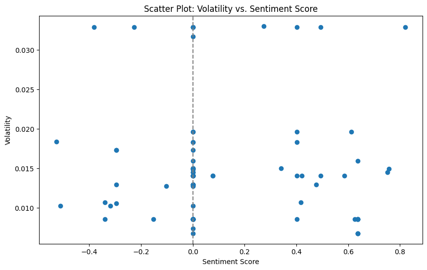

# Stock Market Volatility vs. News Sentiment Analysis

## 📜 Project Overview

This project conducts a deep-dive analysis into the complex relationship between financial news sentiment and stock market volatility. Instead of simply assuming a direct correlation, this project investigates the nuanced, often non-linear interactions between qualitative news data and quantitative market risk indicators.

The analysis focuses on **Alphabet Inc. (GOOGL)**, using a combination of statistical testing and advanced visualization to uncover the true nature of their relationship. The project's journey from a simple linear correlation test to a more complex, conditional hypothesis demonstrates a real-world, iterative analytical process.

---

## 🎯 Key Questions & Hypothesis

The core question of this project was not just "if" sentiment affects volatility, but "how".
1.  Is there a simple, predictable linear relationship between daily news sentiment and daily stock volatility?
2.  If the relationship isn't linear, can a non-linear (monotonic) correlation be identified?
3.  Does the market react instantly, or is there a time lag between a news event and its impact on volatility?
4.  **Final Hypothesis:** The relationship is not a continuous correlation but a **conditional, event-driven** one, where strong sentiment acts as a catalyst or a necessary pre-condition for high volatility states.

---

## 🛠️ Tech Stack & Libraries

*   **Language:** Python
*   **Data Sourcing:**
    *   `yfinance`: For downloading historical stock price data.
    *   `newsapi-python`: For fetching relevant news headlines.
*   **Data Analysis & Manipulation:**
    *   `Pandas`: For data structuring and manipulation.
    *   `NumPy`: For numerical operations (specifically log returns).
    *   `VaderSentiment`: For robust sentiment analysis tailored for news and social media text.
*   **Data Visualization:**
    *   `Matplotlib` & `Seaborn`: For creating insightful static visualizations.

---

## 📂 Methodology & Workflow

The project followed a structured, multi-stage analytical approach:

1.  **Data Sourcing:**
    *   Downloaded 2 years of historical daily stock data for GOOGL using `yfinance`.
    *   Fetched the last 30 days of English news headlines related to 'Google' or 'Alphabet' using `NewsAPI`.

2.  **Feature Engineering:**
    *   **Volatility:** Calculated the 7-day rolling historical volatility from the stock data using logarithmic returns. This serves as our primary risk indicator.
    *   **Sentiment Score:** Calculated a `compound` sentiment score for each news headline using `VaderSentiment`. A daily average sentiment score was then computed to get a single metric per day.

3.  **Data Merging & Alignment:**
    *   The two datasets were merged into a single DataFrame, aligning the stock volatility and the daily average sentiment score by date.
    *   The analysis was focused on the recent 30-day period for which news data was available to ensure a fair comparison.

4.  **Iterative Analysis:**
    *   **Level 1 (Linear Correlation):** Started with a standard **Subplot** and **Pearson correlation** matrix to test for a simple linear relationship.
    *   **Level 2 (Non-Linear Correlation):** Used a **Scatter Plot** and **Spearman Rank Correlation** to test for a more flexible, non-linear (monotonic) relationship.
    *   **Level 3 (Visual Analysis):** Created time-series plots and scatter plots to visually inspect patterns that statistical numbers might miss.
    *   **Level 4 (Time Lag Analysis):** Developed a **Lagged Correlation Matrix** to test the hypothesis that market volatility might react to news from previous days (1, 2, or 3 days prior).

---

## ✨ Key Insights & Results

The analysis revealed a fascinating and non-obvious relationship between sentiment and volatility.

### 1. Simple Correlation is Deceptive
Both the Pearson (linear) and Spearman (non-linear, monotonic) correlation tests returned a value near **zero (~0.01)**. This statistically proves that there is **no simple, consistent, or predictable relationship** between the two variables. A rising sentiment does not consistently lead to a rise or fall in volatility.


### 2. Visual Analysis Reveals the True "Conditional" Relationship
The scatter plot was the key to unlocking the true insight. It revealed that:
*   Periods of **negative sentiment** are almost exclusively correlated with **low volatility**.
*   **High volatility states** (`> 0.03`) were *only* observed when the **news sentiment was positive**.
*   However, positive sentiment does not *guarantee* high volatility; it only **creates the necessary environment** for it.




### 3. The "Sentiment Shock" Trigger
The time-series plot confirmed the findings from the scatter plot. The largest spikes in volatility were consistently preceded by or occurred during periods of strong positive sentiment. This suggests that volatility doesn't react to minor sentiment changes, but to **"sentiment shocks"**—sudden, strong positive news events that act as a trigger.


---

## 🚀 Conclusion

The relationship between news sentiment and stock volatility for Google is not a simple linear correlation. Instead, it is a **complex, conditional, and event-driven phenomenon.**

My analysis demonstrates that while negative or neutral news is associated with market stability (low volatility), **positive news acts as a catalyst that enables periods of high volatility.** Therefore, sentiment should not be used as a direct predictor of volatility, but as an indicator of a potential shift into a high-risk market environment. This insight is crucial for risk management and algorithmic trading strategies.

---

## ⚙️ How to Run this Project Locally

1.  **Clone the repository:**
    ```bash
    git clone https://github.com/hackbuddy1/Stock-Market-Sentiment-analysis.git
    ```
2.  **Navigate to the project directory:**
    ```bash
    cd Stock-Market-Sentiment-analysis
    ```
3.  **Install the required libraries:**
    ```bash
    pip install pandas yfinance newsapi-python vaderSentiment matplotlib seaborn
    ```
4.  **Set up your API Key:**
    *   Get a free API key from [newsapi.org](https://newsapi.org/).
    *   Open the `analysis.ipynb` notebook and replace `'PASTE_YOUR_API_KEY_HERE'` with your actual key.
5.  **Run the Jupyter Notebook:**
    Execute the cells in the `analysis.ipynb` file sequentially to reproduce the analysis.
